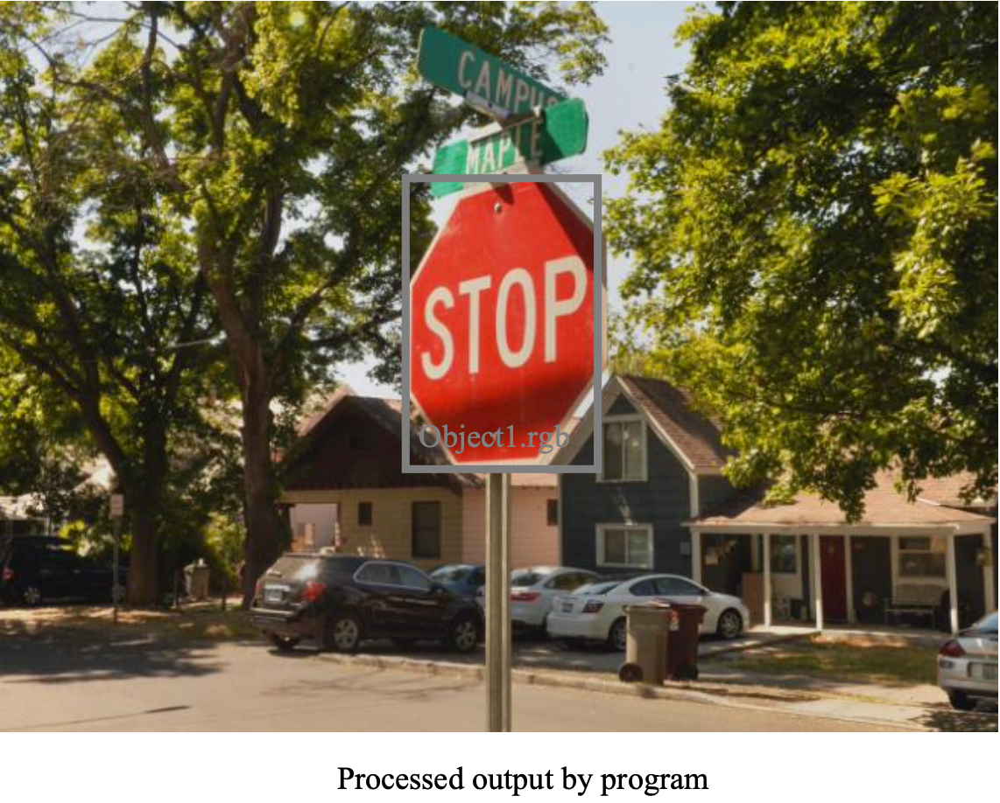

# Color-based Object Detection

## Introduction
Detect and localize colorful objects in images using unique color representations. This project aims to highlight the importance and practical application of color spaces and data structures in color analysis without relying on external libraries.

## Overview 
1. Objective: Understand and apply the concepts of color representations and color spaces for object detection.
2. Methodology: Detect objects based on their unique color characteristics and compare against an input image to localize them.
3. Output: Processed input image with detected objects encased in bounding boxes.

### Sample Results
 

## Dataset
* Object Library: A set of images showcasing distinct color objects against a consistent green background.
* Input Images: Contains multiple objects, some of which are from the object library.

## Implementation Details
### 1. Command Line Parsing
* Input is parsed from the command line, where the first argument is the target image and subsequent arguments are reference images of objects to be detected.
* Each image is read into a `BufferedImage` object for further processing.
### 2. Histogram Comparison
* Each image (both the target and reference images) is transformed into its YUV color space. The histograms for U and V channels are then computed.
* The histogram for the target image is compared with histograms of each of the reference images to determine similarity. Green chroma pixels are excluded from the histogram calculation for object images.
* A similarity threshold determines whether the object is present in the target image.
### 3. Back Projection
* The color distribution of the reference image (model) is projected onto the target image.
* This method evaluates how likely each pixel in the target image belongs to the color distribution of the object (reference) image.
### 4. Post-Processing
* Thresholding: Convert the grayscale probability image resulting from back projection into a binary image.
* Erosion: A morphological operation that shrinks white regions and enlarges black ones.
* Dilation: A morphological operation that expands white regions and shrinks black ones.
### 5. Connected Component Labeling using DFS
* To identify the detected objects in the binary image, we apply a Connected Component Labeling algorithm using Depth First Search (DFS).
* We treat the binary image as a graph where white pixels are nodes. Two nodes are connected if they are adjacent and both are white.
* DFS traverses this graph and groups connected white pixels.
* The bounding boxes of these groups (components) are then computed based on the minimum and maximum x and y coordinates of the pixels in each group.

### Constraints
* No use of external libraries or scripting environments.
* All methods and algorithms are implemented from scratch.

### How to Run
Compile: `javac Main.java` \
Run: `java Main InputImage.rgb object_1.rgb ... object_n.rgb`

