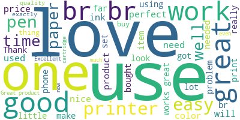
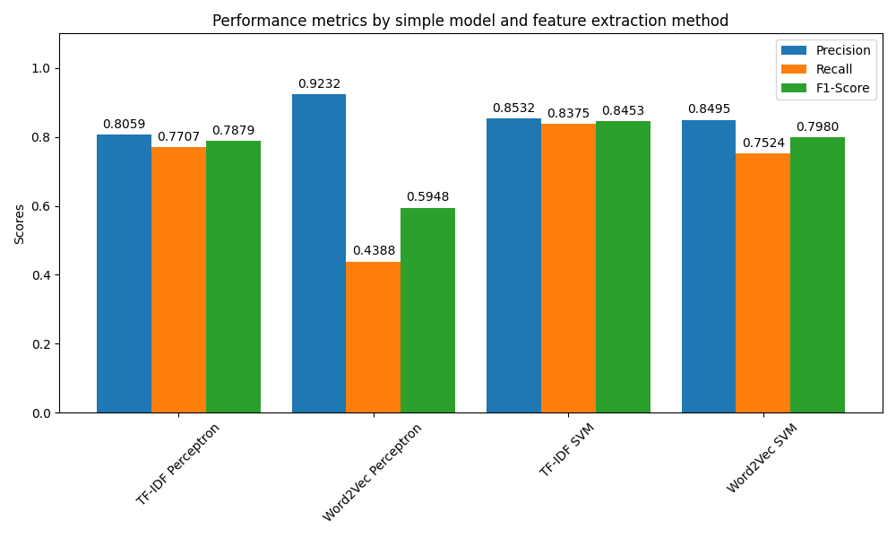

# Sentiment Analysis on Amazon Reviews

## Overview
This project aims to analyze customer reviews and determine their sentiment using various data preprocessing techniques and machine learning models. \
Amazon Review dataset : `https://web.archive.org/web/20201127142707if_/https://s3.amazonaws.com/amazon-reviews-pds/tsv/amazon_reviews_us_Office_Products_v1_00.tsv.gz`
Note: converted file into .csv

## Data Cleaning & Preprocessing
- Converted all reviews to lowercase for consistency.
- Removed HTML tags and URLs from the reviews.
- Handled contractions by expanding them (e.g., "won't" to "will not").
- Removed non-alphabetical characters.
- Removed extra spaces.
- Remove stop words.
- Perform lemmatization.

### Data Visualization
Visualized the frequency of words in positive reviews using a word cloud.

## Text Preprocessing
### Stopword Removal
- Imported stopwords from the `nltk.corpus` library.
- Loaded English stopwords into a set.
- Tokenized reviews and removed stopwords.
- Filtered out rows where reviews were not strings to ensure consistent processing.
- Created a new column 'review_no_stopwords' that stores reviews without stopwords.

### Lemmatization
- Used `WordNetLemmatizer` from the `nltk.stem` library to lemmatize words.
- Tokenized the reviews without stopwords.
- Lemmatized each token to its root form.
- Created a new column 'review_lemmatized' that stores lemmatized reviews.

### Sample Output
| Raw Review | Cleaned Review | Without Stopwords | Lemmatized |
|------------|----------------|-------------------|------------|
| These adapter brackets are bigger than I expected ... | These adapter brackets are bigger than I expected ... | These adapter brackets bigger I expected strong st... | These adapter bracket bigger I expected strong stu... |
| a little flimsy - but gets the job done | a little flimsy - but gets the job done | little flimsy - gets job done | little flimsy - get job done |
| Even tough I rate it with 3 stars, I must note tha... | Even tough I rate it with 3 stars, I must note tha... | Even tough I rate 3 stars , I must note two four b... | Even tough I rate 3 star , I must note two four bo... |
| The gooseneck is too short and a large camera won'... | The gooseneck is too short and a large camera won'... | The gooseneck short large camera wo n't fit . I st... | The gooseneck short large camera wo n't fit . I st... |
| So far it's been good. | So far it's been good. | So far 's good . | So far 's good . |

## Feature Extraction
### Bag of Words (BoW):
Method: Utilized the CountVectorizer from the sklearn library. \
Explanation: The Bag of Words representation creates a "bag" of all the unique words in the dataset, disregarding grammar and word order but preserving multiplicity. \
Implementation: Transformed the lemmatized reviews into a BoW representation, keeping a maximum of 5,000 features. 

### Term Frequency-Inverse Document Frequency (TF-IDF):
Method: Employed the TfidfVectorizer from the sklearn library. \
Explanation: TF-IDF weighs the term frequencies (TF) by how rare the word is in the dataset, which is its inverse document frequency (IDF). This helps in highlighting words that are more interesting and frequent in a given document while penalizing words that appear often across all documents. \
Implementation: Transformed the lemmatized reviews into TF-IDF features, again preserving a maximum of 5,000 features.

### Word2Vec:
Method: Leveraged the pre-trained Word2Vec model from the Google News dataset. \
Explanation: Word2Vec creates dense vector representations of words in a high-dimensional space based on their semantic meaning. Words with similar meanings are represented by vectors that are close to each other in this space. \
Implementation: For each review, computed the average Word2Vec vectors using the model which has a dimensionality of 300. 

## Model Results
### Perceptron:
The Perceptron is a type of linear classifier that updates its weights based on the misclassified samples. We tested the Perceptron classifier using two different feature extraction methods: TF-IDF and Word2Vec.

### Support Vector Machine (SVM):
Support Vector Machine (SVM) is a supervised learning algorithm which can be used for both classification or regression challenges. We specifically used a linear SVM in our case. Similar to the Perceptron, we tested the SVM classifier using TF-IDF and Word2Vec features.

### Model Performance Analysis
The results presented reveal a few key insights about sentiment analysis, especially concerning the combination of feature extraction methods and machine learning models:

Deep Learning vs Linear Models: \
Embeddings vs Sparse Representations: Deep learning models generally perform better with dense embeddings such as Word2Vec. This is because these embeddings capture semantic meanings and relationships between words, which are beneficial for tasks like sentiment analysis. In contrast, sparse representations like TF-IDF mainly capture term frequency and might miss out on these semantic nuances. However, it's worth noting that for specific tasks or datasets, TF-IDF can still be very effective due to its discriminative power.

Linear Models and TF-IDF:  \
Linear models like Perceptron and SVM can sometimes show a preference for the discriminative capabilities of TF-IDF. This is evident from our results, where the TF-IDF SVM model outperformed the Word2Vec SVM model in terms of F1-Score. Linear models, by design, aim to find linear separations in the data. The high dimensionality and discriminative nature of TF-IDF can sometimes aid in this separation, leading to better performance.

## Recurrent Neural Network: Simple RNN, GRU, LSTM

### Data Preprocessing for RNN
Before feeding the reviews into the Recurrent Neural Network, several preprocessing steps are undertaken:

1. Word2Vec Embedding:
- Each word in a review is converted into its corresponding Word2Vec vector.
- If a word is not present in the Word2Vec model's vocabulary, a zero vector is used as a placeholder.
2. Consistent Sequence Length:
- To maintain consistency in input shape, all reviews are transformed to have a length of 10 words.
    - Reviews longer than 10 words are truncated.
    - Shorter reviews are padded with zero vectors.

#### Implementation:
- Tokenization: Reviews are split into individual words.
- Word2Vec Conversion: Each word is represented as its Word2Vec vector using the get_word2vec_sequence function.
- Padding and Truncating: Using the pad_or_truncate_sequence function, each sequence (review) is adjusted to have a consistent length of 10 words.

## Simple RNN Implementation using PyTorch
### Overview:
This section details the implementation of a simple Recurrent Neural Network (RNN) model to process review sequences. The goal is to classify the sentiment of each review based on the processed sequence.
### Hyperparameters:
Input Size: 300 (Dimension of Word2Vec embeddings)
Hidden Size: 10 (Size of the hidden layer in the RNN)
Output Size: 2 (Positive or Negative sentiment)
### Model Architecture:
1. RNN Layer: Processes the input sequences one step at a time, maintaining a hidden state across steps.
2. Fully Connected Layer: Converts the last step's hidden state into a final output (classification).
3. Loss and Optimizer Initialization: CrossEntropyLoss is used as the loss function, and the Adam optimizer is employed for training the model.

## Gated Recurrent Unit (GRU) Implementation using PyTorch
### Overview:
The GRU model offers gating mechanisms for its hidden states, helping it better capture dependencies for different time scales. This section details the construction and training of a simple GRU model to classify sentiment based on review sequences.

### Model Architecture:
1. GRU Layer: A more advanced variant of the RNN, capturing temporal dependencies with gating mechanisms.
2. Fully Connected Layer: Converts the last step's hidden state into a final classification output.
3. Loss and Optimizer Initialization: CrossEntropyLoss is used as the loss function, and the Adam optimizer is employed for training the model.

## Long Short-Term Memory (LSTM) Implementation using PyTorch
### Overview:
LSTM units are a type of RNN architecture known for their ability to capture long-term dependencies in sequence data. This section explores the implementation of an LSTM model for sentiment classification.

### Model Architecture:
1. LSTM Layer: Known for its three types of gates: forget, input, and output, aiding in long-term dependency capture.
2. Fully Connected Layer: For final classification.
3. Loss and Optimizer Initialization: CrossEntropyLoss is used as the loss function, and the Adam optimizer is employed for training the model.

## Model Results

1. Performance Superiority of GRU and LSTM: Both GRU and LSTM models have shown significantly higher accuracies when compared to the Simple RNN. It's evident from the graph that these models outperform the traditional RNN by a considerable margin in terms of accuracy.

2. Gating Mechanisms' Impact: The disparity in performance underscores the effectiveness of gating mechanisms inherent to GRU and LSTM architectures. These mechanisms play a pivotal role in capturing long-term dependencies in the input data. More crucially, they address and mitigate common issues faced by simple RNNs, such as the vanishing and exploding gradient problems. This makes GRU and LSTM particularly adept at handling complex sequences, leading to their enhanced performance.